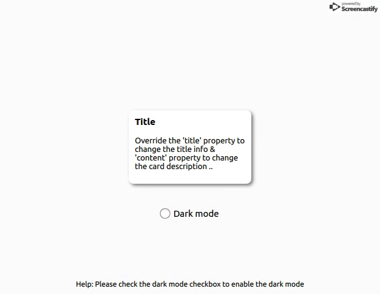

# Qt_app_theme
Sample app that gives us some idea to deal with app theme for qt/qml projects.



1. <b>ThemeManager</b> - a singleton class to manage the app theme.
2. <b>Backend</b> - Bridge between qml and Qt classes.
3. At the runtime based on the user input QObject has been invoked and assigned as the <b>ContextProperty</b> so that all qml can have the access to the same obj.

Important Note: Theme has to be set before the QmlEngine loads the main.qml
i.e.: ```ThemeManager::getInstance()->initTheme(&engine); ``` has to be called before ```engine.load(QUrl(QStringLiteral("qrc:/qml/main.qml"))); ``` call.

Pre requisites:
Qt version > 5.5.1
